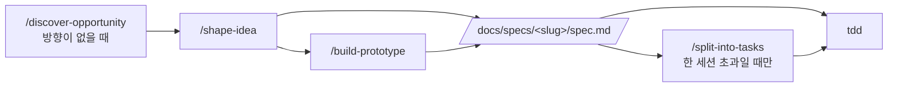

# Harness Engineering Template

[](https://www.claude-hunt.com)
[](https://docs.claude-hunt.com)

> [Claude Hunt](https://www.claude-hunt.com) 강의용 Next.js 16 + React 19 템플릿.
> 사용법과 워크플로우 문서는 [docs.claude-hunt.com](https://docs.claude-hunt.com)에서 확인하세요.

## 기술 스택

- **Framework**: Next.js 16 (App Router)
- **UI**: React 19, Tailwind CSS 4, shadcn/ui, Radix UI, Base UI
- **Icons**: Lucide React
- **Testing**: Vitest, Testing Library, Playwright
- **Lint**: ESLint
- **Package Manager**: Bun

## 시작하기

```bash
bun install
bun dev
```

[http://localhost:3000](http://localhost:3000)에서 결과를 확인할 수 있습니다.

E2E 테스트를 처음 실행하기 전에 Chromium을 설치합니다:

```bash
bunx playwright install chromium
```

## 스크립트

| 명령어 | 설명 |
|---|---|
| `bun dev` | 개발 서버 실행 |
| `bun run build` | 프로덕션 빌드 |
| `bun start` | 프로덕션 서버 실행 |
| `bun run lint` | ESLint 실행 |
| `bun run test` | Vitest 실행 |
| `bun run test:watch` | Vitest 워치 모드 |
| `bun run test:e2e` | Playwright E2E 실행 |

## Hooks

Claude Code hooks 기반 자동 품질 게이트 (`.claude/settings.json`)

| 단계 | 트리거 | 동작 |
|---|---|---|
| **WorktreeCreate** | 워크트리 생성 | `worktree-create.sh`: main 동기화, `.env` 복사, 의존성 설치 |
| **PostToolUse** | `Write\|Edit` | `lint-fix.sh`: ESLint auto-fix |

## 테스트 파일 컨벤션

| 파일 패턴 | 용도 |
|---|---|
| `*.test.tsx` / `*.test.ts` | 단위·통합 테스트 (Vitest, colocated) |
| `*.spec.ts` | E2E 테스트 (Playwright, `e2e/`) |

테스트는 `tdd` 스킬의 규율을 따릅니다 — 합의된 seam에서만, red → green 한 슬라이스씩.

## Claude Code 워크플로우

스킬은 [toy-crane/skills](https://github.com/toy-crane/skills)에서 설치되며 `skills-lock.json`이 버전을 고정합니다. 갱신은 `npx skills update -p`로 합니다.

### 파이프라인



문제와 방향이 이미 정해져 있으면 `shape-idea`에서 시작합니다. 한 세션에 끝나는 작업은 `split-into-tasks`를 건너뛰고 spec에서 바로 구현합니다.

| 스킬 | 하는 일 | 산출물 |
|---|---|---|
| `discover-opportunity` | 만들 것이 없을 때 방향을 찾습니다. 명시적 호출로만 실행되고 문서를 남기지 않습니다 | — |
| `shape-idea` | 문제와 방향을 교정 가능한 초안·프로젝트 근거·렌더된 변형으로 좁혀 구현 가능한 spec까지 씁니다 | `docs/specs/<slug>/spec.md` |
| `build-prototype` | 화면 전체를 더미 데이터 HTML 한 파일로 만들어 눈으로 판정합니다 | `docs/specs/<slug>/prototype.html` |
| `split-into-tasks` | spec을 세션 크기의 수직 Task로 자릅니다. 각 Task는 새 세션에서 실행합니다 | `docs/specs/<slug>/tasks/` |
| `tdd` | 합의된 seam에서 red → green 한 슬라이스씩 구현합니다 | 코드 + 커밋 |

### 파이프라인 밖

| 스킬 | 켜지는 시점 |
|---|---|
| `project-knowledge` | 프로젝트 용어가 정해지거나 되돌리기 비싼 결정이 오갈 때 자동으로 — `GLOSSARY.md`와 `docs/decisions/`를 관리합니다 |
| `add-stack-context` | 프레임워크·서비스 벤더의 공식 에이전트 컨텍스트를 설치할 때 |
| `explain-visually` | 개념·흐름·코드 설명을 요청할 때 |
| `compact-decisions` | 여러 작업이 배포된 뒤 결정·용어집·spec 폴더를 정리할 때 |

### 프로젝트 메모리

지속되는 프로젝트 지식은 `project-knowledge`가 두 곳에 씁니다.

- `GLOSSARY.md` — 프로젝트 용어
- `docs/decisions/README.md` — 결정 라우터. 각 주제는 `docs/decisions/<subject>.md`에 현재 유효한 결정만 담고, 이전 버전은 git 히스토리가 가집니다

`shape-idea`와 `tdd`는 작업 전에 이 라우터를 읽고 관련 주제만 로드합니다. 빈 상태로 시작해 작업하면서 채워집니다.

### AGENTS.md

`AGENTS.md`의 `nextjs-agent-rules` 블록과 `CLAUDE.md`는 **Next.js가 관리합니다.** `next dev`가 에이전트를 감지하면 다시 써넣으므로 직접 수정하지 않습니다. 에이전트를 `node_modules/next/dist/docs/`의 버전 매칭 문서로 보내는 역할이며, 이전에 쓰던 `next-best-practices` 스킬을 대체합니다. 끄려면 `next.config.ts`에 `agentRules: false`를 넣습니다.

프로젝트 고유의 지침은 이 파일이 아니라 `docs/decisions/`에 씁니다.

### 검증 책임

| 실패 양상 | 담당 |
|---|---|
| 잘못된 것을 만듦 | `shape-idea`의 교정 루프, `build-prototype`의 렌더 확인 |
| 동작이 깨짐 | `tdd`의 red → green, `bun run test` / `test:e2e` |
| 품질 (버그, 중복, 비효율) | 내장 `/code-review` |
| 지식이 흩어짐 | `project-knowledge`, `compact-decisions` |

각 단계는 human review gate를 가집니다. 현재 단계가 검증되기 전에는 다음 단계로 넘어가지 않습니다.
