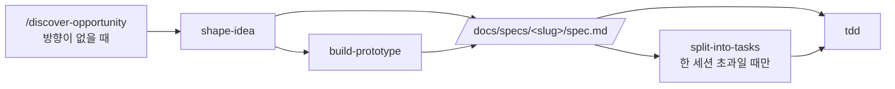

# Claude Code Playbook Template

[](https://www.claude-hunt.com)
[](https://docs.claude-hunt.com)

> [Claude Hunt](https://www.claude-hunt.com) 강의용 Next.js 16 + React 19 템플릿.
> 사용법과 워크플로우 문서는 [docs.claude-hunt.com](https://docs.claude-hunt.com)에서 확인하세요.

## 기술 스택

Next.js 16 (App Router) · React 19 · Tailwind CSS 4 · shadcn/ui · Bun

## 시작하기

```bash
bun install
bun dev
```

[http://localhost:3000](http://localhost:3000)에서 결과를 확인할 수 있습니다.

## 스크립트

| 명령어 | 설명 |
|---|---|
| `bun dev` | 개발 서버 실행 |
| `bun run build` | 프로덕션 빌드 |
| `bun start` | 프로덕션 서버 실행 |
| `bun run lint` | ESLint 실행 |

## Claude Code 워크플로우



파이프라인 밖에서는 `project-knowledge`, `add-stack-context`, `explain-visually`, `compact-decisions`가 각자의 조건에 따라 켜집니다. 남길 만한 지식은 `project-knowledge`가 `GLOSSARY.md`와 `docs/decisions/`에 씁니다.
