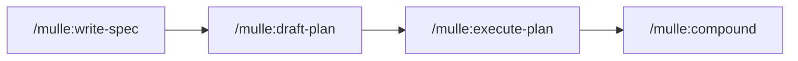

# Harness Engineering Template

[](https://www.claude-hunt.com)
[](https://docs.claude-hunt.com)

> [Claude Hunt](https://www.claude-hunt.com) 강의용 Next.js 16 + React 19 템플릿.
> 사용법과 워크플로우 문서는 [docs.claude-hunt.com](https://docs.claude-hunt.com)에서 확인하세요.

## 기술 스택

- **Framework**: Next.js 16 (App Router)
- **UI**: React 19, Tailwind CSS 4, shadcn/ui, Radix UI, Base UI
- **Icons**: Lucide React
- **Testing**: Vitest, Testing Library, Playwright
- **Lint**: ESLint
- **Package Manager**: Bun

## 시작하기

```bash
bun install
bun dev
```

[http://localhost:3000](http://localhost:3000)에서 결과를 확인할 수 있습니다.

E2E 테스트를 처음 실행하기 전에 Chromium을 설치합니다:

```bash
bunx playwright install chromium
```

## 스크립트

| 명령어 | 설명 |
|---|---|
| `bun dev` | 개발 서버 실행 |
| `bun run build` | 프로덕션 빌드 |
| `bun start` | 프로덕션 서버 실행 |
| `bun run lint` | ESLint 실행 |
| `bun run test` | Vitest 실행 |
| `bun run test:watch` | Vitest 워치 모드 |
| `bun run test:e2e` | Playwright E2E 실행 |

`spec-coverage <feature> [--tests|--wireframe]` 커버리지 검사는 물레 플러그인이 PATH에 제공합니다.

## Hooks

자동 품질 게이트는 [물레(mulle) 플러그인](https://github.com/toy-crane/mulle)이 제공합니다.

| 단계 | 트리거 | 동작 |
|---|---|---|
| **WorktreeCreate** | 워크트리 생성 | main 동기화, `.env` 복사, 의존성 설치 (bun 프로젝트에서만) |
| **PostToolUse** | `Write\|Edit` | ESLint auto-fix (ESLint 설정이 있을 때만) |

## 테스트 파일 컨벤션

| 파일 패턴 | 용도 |
|---|---|
| `*.test.tsx` / `*.test.ts` | 단위·통합·판정 기준 테스트 (Vitest, colocated) |
| `*.spec.ts` | E2E 테스트 (Playwright, `e2e/`) |

테스트 이름에는 담당하는 spec 판정 기준 ID를 `[S1-1]` 형식으로 인용합니다. 자세한 테스팅 원칙은 [CLAUDE.md → Testing](./CLAUDE.md#testing)을 참조합니다.

## Claude Code 워크플로우 — 물레(mulle)

Spec-driven development 워크플로우는 [물레(mulle) 플러그인](https://github.com/toy-crane/mulle)이 제공합니다. 이 템플릿을 Claude Code로 열고 폴더를 신뢰하면 `.claude/settings.json`의 `enabledPlugins` 설정에 따라 설치 프롬프트가 뜹니다.

수동 설치:

```
/plugin marketplace add toy-crane/mulle
/plugin install mulle@mulle
```

### 코어 경로



모든 feature가 통과하는 경로입니다. 한 세션에 끝나고 diff를 한 문장으로 설명할 수 있는 작업은 코어 경로 대신 Claude Code 내장 plan 모드로 진행합니다. 단계별 상세·옵션 모듈·검증 책임은 [플러그인 README](https://github.com/toy-crane/mulle)와 [CLAUDE.md](./CLAUDE.md)의 물레 섹션을 참조하세요.

### 플러그인 업데이트

```
/plugin marketplace update mulle
/mulle:init
```

새 버전을 받은 뒤 `/mulle:init`을 재실행하면 CLAUDE.md의 워크플로우 규칙 섹션(마커 기반)이 최신으로 갱신됩니다.
