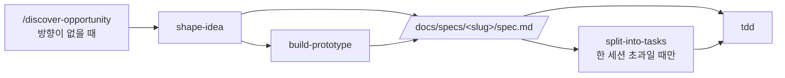

# Harness Engineering Template

[](https://www.claude-hunt.com)
[](https://docs.claude-hunt.com)

> [Claude Hunt](https://www.claude-hunt.com) 강의용 Next.js 16 + React 19 템플릿.
> 사용법과 워크플로우 문서는 [docs.claude-hunt.com](https://docs.claude-hunt.com)에서 확인하세요.

## 기술 스택

Next.js 16 (App Router) · React 19 · Tailwind CSS 4 · shadcn/ui · Bun

## 시작하기

```bash
bun install
bun dev
```

[http://localhost:3000](http://localhost:3000)에서 결과를 확인할 수 있습니다.

## 스크립트

| 명령어 | 설명 |
|---|---|
| `bun dev` | 개발 서버 실행 |
| `bun run build` | 프로덕션 빌드 |
| `bun start` | 프로덕션 서버 실행 |
| `bun run lint` | ESLint 실행 |

## 테스트

Vitest·Testing Library·Playwright는 의존성만 설치돼 있고 설정 파일과 스크립트는 아직 없습니다. 도입할 때 `*.test.ts` / `*.test.tsx`는 Vitest로 소스 옆에, `e2e/*.spec.ts`는 Playwright로 두는 배치를 씁니다.

## Hooks

`.claude/settings.json`이 `Write`/`Edit` 후 ESLint auto-fix를 자동으로 겁니다(`lint-fix.sh`). 고칠 수 없는 에러가 남으면 exit 2로 에이전트에게 되돌려 다시 고치게 합니다.

## Claude Code 워크플로우

스킬은 [toy-crane/skills](https://github.com/toy-crane/skills)에서 설치되며 `skills-lock.json`이 버전을 고정합니다. 설치와 갱신은 `npx skills update -p`로 합니다.



문제와 방향이 이미 정해져 있으면 `shape-idea`에서 시작합니다. 한 세션에 끝나는 작업은 `split-into-tasks`를 건너뛰고 spec에서 바로 구현합니다. 파이프라인 밖에서는 `project-knowledge`, `add-stack-context`, `explain-visually`, `compact-decisions`가 각자의 조건에 따라 켜집니다.

산출물은 `docs/specs/<slug>/`에 모이고, 지속되는 프로젝트 지식은 `project-knowledge`가 `GLOSSARY.md`와 `docs/decisions/`에 씁니다. 셋 다 없는 상태로 시작해 스킬이 작업 중에 만듭니다.

### AGENTS.md

`AGENTS.md`의 `nextjs-agent-rules` 블록과 `CLAUDE.md`는 **Next.js가 관리합니다.** `next dev`가 에이전트를 감지하면 다시 써넣으므로 직접 수정하지 않습니다. 끄려면 `next.config.ts`에 `agentRules: false`를 넣습니다.

그 아래 `언어` 섹션은 이 프로젝트 것입니다. 마커 밖이라 재생성에 지워지지 않습니다. 그 밖의 프로젝트 고유 지침은 이 파일이 아니라 `docs/decisions/`에 씁니다.
