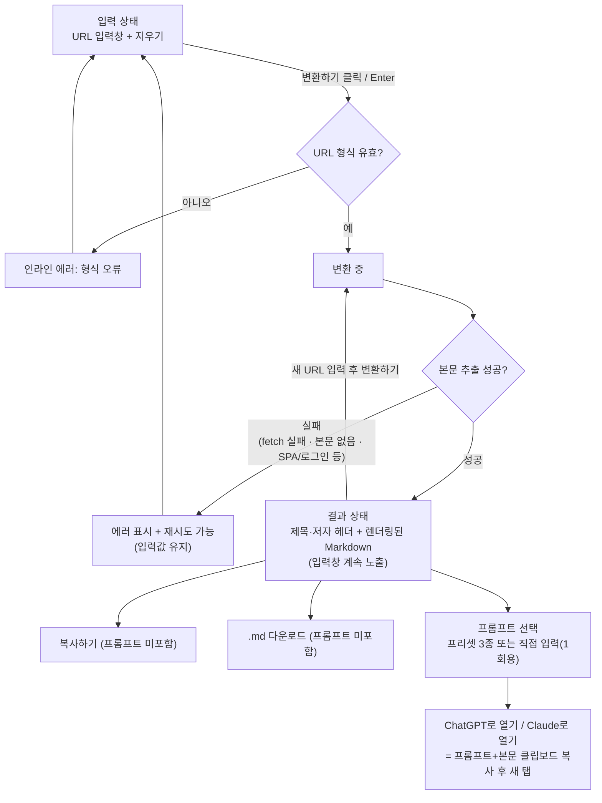

# URL → Markdown → LLM 전달 도구

웹 페이지 URL을 붙여넣으면 본문을 Markdown으로 추출해 보여주고, 복사·다운로드하거나 프롬프트와 함께 ChatGPT·Claude로 바로 넘길 수 있는 단일 화면 도구.

## 사용자에게 보이는 결과

- 계정 없이 URL 하나만 붙여넣고 "변환하기"를 누르면, 그 페이지의 본문을 깨끗한 Markdown으로 즉시 확인할 수 있다.
- 결과 화면에는 원문의 제목과 저자(있는 경우)가 헤더로, 그 아래 렌더링된 Markdown 본문이 표시된다.
- 결과를 클립보드에 복사하거나 `.md` 파일로 저장할 수 있다.
- 요약/번역/쉽게 설명 같은 프롬프트를 골라(또는 직접 써서) 본문과 함께 ChatGPT 또는 Claude 새 대화로 바로 이어갈 수 있다.
- 다크모드를 토글로 전환할 수 있다.

## 화면 흐름

입력창은 결과가 표시된 뒤에도 계속 노출되는 단일 화면 구조다. 화면 전환 없이 같은 자리에서 새 URL을 반복해서 변환할 수 있다.

## 승인된 범위

1. **입력** — URL 붙여넣기, 지우기(입력값과 결과를 함께 초기화)
2. **변환** — "변환하기" 액션(버튼 클릭 또는 Enter)으로 대상 페이지를 가져와 defuddle로 본문·메타데이터 추출
3. **결과 확인** — 제목·저자 헤더 + 렌더링된 Markdown, 입력창은 결과 화면에서도 계속 노출
4. **내보내기** — 복사하기, `.md` 다운로드, ChatGPT로 열기, Claude로 열기
5. **프롬프트** — 프리셋 3종(요약해줘 / 한국어로 번역해줘 / 쉽게 설명해줘) + 직접 입력(1회용, 저장 안 함). "~로 열기"에만 적용
6. **다크모드 토글**

## 관찰 가능한 인수 기준

- 유효한 URL을 붙여넣고 변환하기를 누르면 로딩 상태를 거쳐 제목(+저자, 있는 경우) 헤더와 Markdown 렌더링 결과가 보인다.
- URL 형식이 아닌 값을 넣고 변환을 시도하면 인라인 에러가 뜨고 요청이 나가지 않는다.
- 대상 페이지를 가져오지 못하거나(네트워크 실패, 404, 접근 거부 등) 본문을 추출하지 못하면(사실상 빈 본문, SPA, 로그인 필요, HTML이 아닌 파일 등) 에러 메시지가 뜨고, 입력값은 유지된 채 같은 화면에서 재시도할 수 있다.
- 사설 IP·루프백·링크로컬 주소(예: `127.0.0.1`, `169.254.169.254`, `192.168.x.x`, `localhost`)를 가리키는 URL은 실제로 그 주소에 요청을 보내지 않고 위와 같은 에러로 거부된다. 리다이렉트를 따라가는 경우에도 각 홉마다 같은 검사를 적용한다.
- 원문이 UTF-8이 아닌 인코딩(예: EUC-KR)이어도 본문이 깨지지 않고 올바르게 표시된다.
- 지우기를 누르면 입력창과 결과가 함께 비워져 처음 상태로 돌아간다.
- 결과가 보이는 상태에서 입력창에 새 URL을 붙여넣고 변환하기를 누르면 화면 전환 없이 그 결과로 교체된다.
- 복사하기를 누르면 선택된 프롬프트와 무관하게 Markdown 본문만 클립보드에 복사된다.
- `.md` 다운로드를 누르면 선택된 프롬프트와 무관하게 Markdown 본문만 담긴 파일이 저장된다.
- 프롬프트 프리셋(3종) 중 하나를 고르거나 "직접 입력"을 선택해 문구를 쓸 수 있다. 직접 입력한 문구는 세션 내에서만 유지되고 저장되지 않는다.
- "ChatGPT로 열기"·"Claude로 열기"를 누르면 (프롬프트를 골랐다면 프롬프트+본문을, 아니면 본문만) 클립보드에 복사하고 해당 서비스의 새 대화 페이지를 새 탭으로 연다. 프롬프트를 고르지 않은 상태로 눌러도 동작한다.
- 다크모드 토글을 누르면 즉시 테마가 바뀌고, 이후 방문에서도 선택이 유지된다.

## 정해진 제약과 근거

- **본문 추출은 defuddle 라이브러리로 한다** — 요구사항으로 확정.
- **ChatGPT·Claude로 열기는 클립보드 복사 + 새 탭 열기로만 구현한다**(URL 프리필 방식은 쓰지 않는다) — 근거는 `docs/decisions/llm-handoff-method.md`.
- **대상 페이지는 서버가 받은 HTML을 그대로 처리하며, 헤드리스 브라우저 렌더링은 하지 않는다** — 근거는 `docs/decisions/page-fetch-scope.md`.
- **프롬프트는 "~로 열기"에만 적용된다** — 복사하기·다운로드는 항상 프롬프트 없는 순수 본문만 담아, 원본 그대로 저장·공유하는 용도와 LLM에 보낼 지시문이 섞이는 용도를 구분한다.
- **변환은 명시적 액션으로만 시작한다** — 붙여넣기·타이핑마다 불필요한 외부 요청이 나가는 것을 막고, 사용자가 붙여넣은 URL을 검토·수정할 여유를 준다.
- **서버는 사설·루프백·링크로컬 등 내부망 주소로는 요청을 보내지 않는다(SSRF 방지)** — 임의의 사용자 제공 URL을 서버가 대신 가져오는 구조이므로, 이 검증이 없으면 이 도구가 내부망 접근 통로로 악용될 수 있다. 취향이 아니라 보안 정합성 문제로 간주해 협의 없이 확정한다.

## 가정 (저비용·번복 가능, 확정된 결정 아님)

- URL 유효성 검사는 표준 URL 형식(http/https 스킴 포함) 기준으로 하고, 실패 시 인라인 에러 문구를 보여준다.
- 저자 정보가 없는 페이지는 헤더에서 저자 항목을 표시하지 않는다.
- 결과 헤더는 브리프에 명시된 제목·저자 두 항목만 표시한다. defuddle이 함께 주는 다른 메타데이터(사이트명, 발행일 등)는 이번 범위에 넣지 않는다.
- `.md` 다운로드 파일명은 추출된 제목을 슬러그화해 사용하고, 제목이 없으면 도메인+날짜로 대체한다.
- 다크모드는 시스템 설정을 기본값으로 따르되 토글로 수동 전환할 수 있다.
- 계정, 로그인, 변환 이력 저장은 없다. 커스텀 프롬프트뿐 아니라 변환 결과 자체도 서버에 별도로 보관되지 않는다.

## 범위 밖

- **로그인/계정/변환 이력 저장** — 브리프에 없고, "직접 입력 프롬프트는 1회용(저장 안 함)"이라는 요구와도 맞지 않아 제외한다.
- **ChatGPT·Claude 외 다른 LLM 연동** — 브리프에 명시된 두 서비스만 대상으로 한다.
- **번역·요약을 이 앱이 직접 수행하는 것** — 프롬프트는 대상 LLM에게 넘길 지시문일 뿐, 이 앱 자체가 텍스트를 가공하지 않는다.
- **SPA/로그인 필요 페이지 지원(헤드리스 브라우저 렌더링)** — `docs/decisions/page-fetch-scope.md`에 따라 제외한다.

## 보류한 지점

- 없음 — 구현에 필요한 결정은 모두 확정되었거나 위 가정·제약으로 처리됐다.

## 남은 리스크

- SPA로 렌더링되거나 로그인·봇 차단이 있는 페이지는 추출이 실패한다. 실제 사용자가 시도하는 URL 중 이런 비율이 높다면 체감 성공률이 낮아질 수 있다(재검토 조건은 `docs/decisions/page-fetch-scope.md` 참고).
- ChatGPT·Claude 각 서비스가 새 탭의 입력창 텍스트 길이에 자체 제한을 두고 있다면, 매우 긴 문서는 클립보드 복사 이후 서비스 쪽에서 잘리거나 거부될 수 있다. 클립보드 복사까지는 정상 동작하므로 이 앱의 책임 범위 밖이다.
- 클립보드 복사는 브라우저의 클립보드 권한·HTTPS 컨텍스트에 의존한다. 권한이 막힌 환경에서는 복사가 실패할 수 있다.
- 사설 IP 차단은 호스트명 검사 시점과 실제 요청 시점 사이에 DNS 응답이 바뀌는 경우(DNS rebinding)까지는 막지 못한다. 공개 배포를 검토할 때 다시 봐야 한다.
