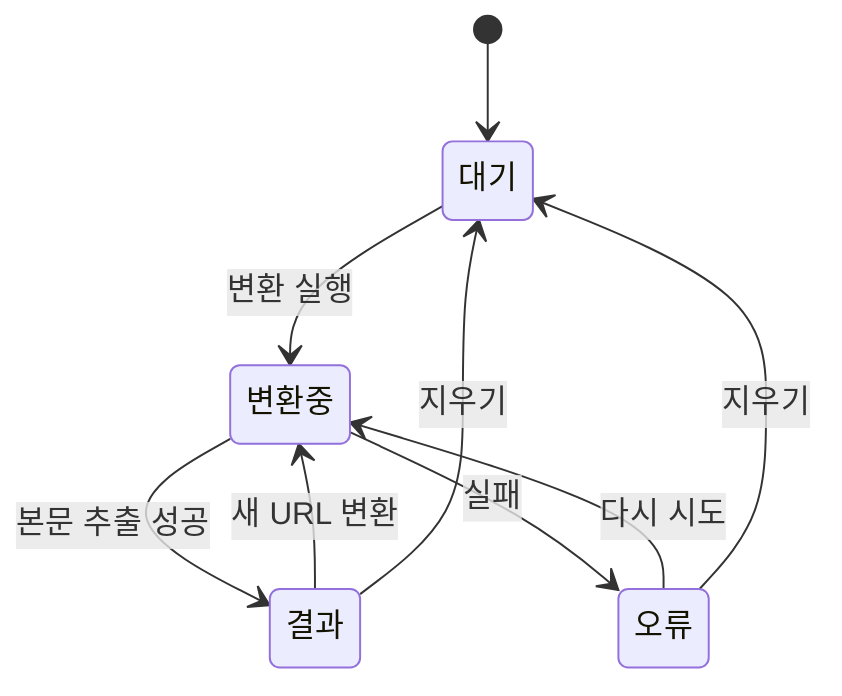

# URL → Markdown 변환기

웹 페이지 URL을 붙여넣으면 본문을 Markdown으로 뽑아내고, 그대로 복사·다운로드하거나
ChatGPT·Claude 대화창으로 넘길 수 있는 단일 페이지 도구.

사용자가 "물어보지 말고 보편적인 값으로 정하라"고 명시적으로 위임했으므로, 아래 결정은
모두 그 위임 아래 내려졌다. 되돌리기 쉬운 선택은 **가정**으로 표시했다.

---

## 1. 범위

| 포함 | 제외 |
|---|---|
| 단일 페이지(`/`) | 계정·로그인 |
| URL 1개 → 결과 1개 | 변환 이력·저장소 |
| 서버에서 페이지 가져오기 + 본문 추출 | 여러 URL 일괄 변환 |
| 복사 / `.md` 다운로드 / ChatGPT·Claude 보내기 | 공개 API·요금제·사용량 제한 |
| 한국어 UI | 다국어 UI |

상태를 서버에 남기지 않는다. 데이터베이스 없음.

---

## 2. 사용자 흐름과 화면 상태

화면은 하나이고, 아래 상태 사이를 오간다.



### 2.1 대기

- URL 입력란 하나 + `변환` 버튼.
- 입력값이 있을 때만 입력란 안쪽에 `지우기`(✕) 버튼이 뜬다. 누르면 입력·결과·오류가 모두 초기화되고 입력란에 포커스가 간다.
- 입력값이 비어 있으면 `변환` 버튼은 비활성.
- Enter 키로도 변환이 실행된다.
- 스킴이 없으면 `https://`를 자동으로 붙여 해석한다. (`example.com/post` → `https://example.com/post`)

### 2.2 변환중

- `변환` 버튼이 스피너 + `변환 중…`으로 바뀌고 입력란과 함께 비활성화된다.
- 결과 영역에는 헤더·본문 자리의 스켈레톤을 보여 준다.
- 실측 기준 대부분 2초 안에 끝난다(§6). 별도의 취소 버튼은 두지 않는다.

### 2.3 결과

위에서부터 세 덩어리.

**① 문서 헤더**
- 제목 (필수, 없으면 도메인으로 대체)
- 저자 · 발행일 · 사이트명 · 도메인 · 파비콘
- 단어 수와 예상 읽기 시간 (분당 500단어 기준, 최소 1분)
- 원본 URL 링크 (`target="_blank" rel="noopener noreferrer"`)
- **비어 있는 항목은 자리를 남기지 않고 감춘다.** 저자·발행일이 빠지는 페이지가 흔하다(§6 실측: toss.tech, GitHub).
- 파비콘은 `new URL(favicon, 원본URL)`로 절대 경로화한다. defuddle이 `/favicon.ico?...` 같은 상대 경로를 그대로 돌려주기 때문이다. 이미지 로드에 실패하면 파비콘만 감춘다.

**② 내보내기 바**
- `복사하기`, `.md 다운로드`, `ChatGPT로 보내기`, `Claude로 보내기`
- 본문이 길어지므로 스크롤해도 따라오도록 상단 고정(sticky).

**③ 본문**
- `미리보기` / `원문` 세그먼트 토글. 기본값은 `미리보기`. *(가정 — 되돌리기 쉬움)*
- `미리보기`: Markdown을 렌더링해 보여 준다.
- `원문`: Markdown 원문을 고정폭 글꼴 그대로 보여 준다.

### 2.4 오류

입력란 바로 아래에 인라인 오류 카드로 표시한다. 모달을 쓰지 않는다.
카드에는 제목 한 줄, 설명 한 줄, `다시 시도` 버튼을 둔다.

| 조건 | 문안 |
|---|---|
| URL 형식이 잘못됨, `http`/`https` 외 스킴, 사설·루프백 주소 | **주소를 확인해 주세요** — 웹 페이지 주소(http/https)만 변환할 수 있습니다. |
| 401 · 403 · 429 | **페이지가 접근을 거부했습니다** — 로그인이 필요하거나 자동 수집을 막는 사이트입니다. |
| 404 · 410 | **페이지를 찾을 수 없습니다** — 주소가 바뀌었거나 삭제된 페이지입니다. |
| 5xx · 네트워크 실패 · 타임아웃 · 용량 초과 | **페이지를 가져오지 못했습니다** — 잠시 후 다시 시도해 주세요. |
| `text/html`·`application/xhtml+xml`이 아님 | **HTML 페이지가 아닙니다** — PDF·이미지·파일 주소는 변환할 수 없습니다. |
| 추출 결과가 사실상 비어 있음 | **본문을 찾지 못했습니다** — JavaScript로 그려지는 페이지이거나 글 본문이 없는 주소일 수 있습니다. |

---

## 3. 내보내기 동작

세 갈래 모두 **같은 Markdown 문자열**을 쓴다. `원문` 탭에 보이는 것과 복사·다운로드·전송되는 것이 동일하다.

### 3.1 Markdown 조립

YAML frontmatter를 항상 앞에 붙인다. LLM에 넘길 때 출처가 같이 가는 것이 이 도구의 목적이기 때문이다.
값이 없는 키는 줄째로 생략한다.

```markdown
---
title: "Next.js 15"
source: "https://nextjs.org/blog/next-15"
author: "Delba de Oliveira"
published: "2024-10-21"
---

Next.js 15 is officially stable and ready for production...
```

- 큰따옴표로 감싸고 내부 `"`와 `\`는 이스케이프한다.
- `published`는 `YYYY-MM-DD`로 정규화한다. 파싱 실패 시 원문 그대로 둔다.

### 3.2 복사하기

`navigator.clipboard.writeText`. 성공하면 버튼 라벨이 2초간 `복사됨 ✓`으로 바뀐다.
클립보드 API가 막힌 환경에서는 오류 토스트 대신 `원문` 탭을 열어 직접 선택할 수 있게 안내한다.

### 3.3 .md 다운로드

- 파일명: 제목을 슬러그화(소문자, 공백·특수문자 → `-`, 연속 `-` 축약, 80자 컷) + `.md`
- 한글 제목은 그대로 남긴다. 슬러그가 비면 `도메인-YYYY-MM-DD.md`로 대체한다.
- 클라이언트에서 `Blob` + `URL.createObjectURL`로 처리한다. 서버 왕복 없음.

### 3.4 ChatGPT · Claude로 보내기

**동작: 클립보드에 복사한 뒤 새 탭으로 `https://chatgpt.com/` 또는 `https://claude.ai/new`를 연다.**
버튼을 누른 직후 `복사했습니다. 대화창에 붙여넣기(⌘V) 하세요.`를 인라인으로 안내한다.

`?q=`로 프롬프트를 미리 채우는 방식은 쓰지 않는다.
- 실측 본문이 9KB–39KB(§6)라 URL 길이 한계를 그냥 넘긴다.
- Claude의 `?q=` 지원은 현재 보장되지 않는다(2025년 중 제거되었다는 보고가 있고 공식 문서에 없음).

*(가정 — 두 서비스 중 하나가 안정적인 프리필 경로를 공식화하면 재검토)*

---

## 4. 추출 파이프라인

브라우저에서 임의 URL을 직접 `fetch`하면 CORS로 막히므로, 서버에서 가져온다.

**Server Function(`'use server'`) + `useActionState`** 로 구현한다. 공개할 API가 없으므로 Route Handler를 두지 않는다.

```
사용자 입력
  → URL 정규화·검증
  → 가드된 fetch (리다이렉트 수동 추적)
  → charset 판별 후 디코드
  → linkedom parseHTML → Document
  → Defuddle(document, url, { markdown: true, fetch: 가드된fetch })
  → 결과 검증 (본문 길이)
  → { title, author, site, domain, favicon, published, wordCount, markdown }
```

### 4.1 URL 검증

- `http`/`https`만 허용. 그 외 스킴(`file:`, `data:`, `javascript:` 등)은 즉시 거부.
- 호스트가 사설·루프백·링크로컬·메타데이터 대역이면 거부:
  `127.0.0.0/8`, `10/8`, `172.16/12`, `192.168/16`, `169.254/16`(169.254.169.254 포함), `::1`, `fc00::/7`, `fe80::/10`, `localhost`, `.local`, `.internal`
- 호스트명은 DNS 해석 결과 IP까지 검사한다. 이름만 보면 우회된다.

### 4.2 가드된 fetch

| 항목 | 값 |
|---|---|
| 리다이렉트 | `redirect: 'manual'`로 직접 추적, 최대 5회, **홉마다 §4.1 검증 재적용** |
| 타임아웃 | 10초 (`AbortSignal.timeout`) |
| 응답 크기 | 5MB 초과 시 중단 |
| `Content-Type` | `text/html`, `application/xhtml+xml`만 통과 |
| `User-Agent` | 일반 데스크톱 브라우저 UA |
| `Accept-Language` | `ko,en;q=0.9` |

`redirect: 'follow'`를 쓰면 중간 홉이 감춰져 공개 URL → 사설 IP 우회가 가능하다. 반드시 수동 추적한다.

### 4.3 defuddle의 자체 네트워크 호출

defuddle의 `useAsync` 옵션은 기본값이 `true`라, 로컬 HTML에서 본문을 못 찾으면 추출기가
서드파티 API를 직접 호출한다. 이 경로는 §4.2 가드를 우회한다.

**`options.fetch`에 §4.2의 가드된 fetch를 주입한다.** (`useAsync: false`로 끄면 YouTube 자막 등
유용한 추출기가 함께 죽으므로 주입 쪽을 택한다.)

### 4.4 문자 인코딩

`Response.text()`는 UTF-8을 가정한다. 국내 구형 사이트에는 EUC-KR이 남아 있다.

`ArrayBuffer`로 받아, `Content-Type` 헤더의 `charset` → HTML 앞 1KB의 `<meta charset>`/
`http-equiv` 순서로 인코딩을 정하고 `TextDecoder`로 디코드한다. 판별 실패 시 UTF-8.

### 4.5 defuddle 호출

```ts
import { Defuddle } from 'defuddle/node'
import { parseHTML } from 'linkedom'

const { document } = parseHTML(html)
const result = await Defuddle(document, url, { markdown: true, fetch: guardedFetch })
// markdown: true 이면 result.content 자체가 Markdown이다.
```

- **HTML 문자열을 그대로 넘기지 않는다.** defuddle 0.19에서 문자열 입력은 deprecated이고
  다음 메이저에서 제거 예정이다. `Document`를 만들어 넘기는 경로만 쓴다.
- `markdown: true`와 `separateMarkdown: true`를 **같이 주면 `contentMarkdown`이 빈 문자열로 나온다**(§6 실측). 하나만 쓴다. 여기서는 `markdown: true`.
- DOM 구현은 **linkedom**. jsdom 대비 파싱이 빠르고(§6), 순수 JS라 Next 번들링 예외 설정이 필요 없다.
  linkedom은 defuddle 설치 시 따라 들어오지만 defuddle의 선언된 의존성에 없으므로, **직접 `package.json`에 명시**한다.

### 4.6 결과 검증

`result.wordCount < 20`이면 "본문을 찾지 못했습니다" 오류로 처리한다.
0으로만 검사하면 안 된다 — SPA 껍데기가 200 + `wordCount: 7`로 통과한다(§6 실측: d2.naver.com).

---

## 5. 표시와 스타일

- **Markdown을 렌더링한다. defuddle의 HTML을 그대로 넣지 않는다.** `react-markdown` + `remark-gfm`을
  기본 설정(원시 HTML 미렌더)으로 쓴다. 임의 사이트의 콘텐츠이므로 `rehype-raw`는 쓰지 않는다.
  이것이 별도 sanitizer 없이 XSS를 막는 방법이다.
- 본문 타이포그래피는 `@tailwindcss/typography`의 `prose` / `prose-invert`.
- 레이아웃: 가운데 정렬 단일 컬럼, `max-w-3xl`. 모바일 반응형.
- 다크 모드는 시스템 설정을 따른다(템플릿 기존 방식 유지). *(가정)*
- 버튼·입력은 기존 shadcn/ui + Base UI 컴포넌트를 쓴다.

### 추가 의존성

`defuddle`, `linkedom`, `react-markdown`, `remark-gfm`, `@tailwindcss/typography`

---

## 6. 결정의 근거가 된 실측

`defuddle@0.19.2` + Node fetch로 직접 확인한 값이다.

| URL | 결과 | 비고 |
|---|---|---|
| nextjs.org/blog/next-15 | 200, 제목·저자·발행일 모두 있음, 39KB MD | fetch 160ms / parse 406ms(jsdom) · 217ms(linkedom) |
| en.wikipedia.org/wiki/Markdown | 200, 33KB MD | 전용 추출기 `wikipedia` |
| news.ycombinator.com | 200, 2KB MD | 전용 추출기 `hackernews` |
| github.com/kepano/defuddle | 200, 13KB MD | **발행일 없음** |
| toss.tech/article/... | 200, 9KB MD | **저자·발행일 없음** |
| medium.com/... | **403** | 자동 수집 차단 |
| example.com/…404 | **404** | |
| arxiv.org/pdf/... | 200이지만 `application/pdf`, 결과 전부 빈 값 | content-type 가드 필요 |
| d2.naver.com/helloworld/... | 200이지만 `wordCount: 7` (SPA 껍데기) | 0 검사로는 못 거름 |

전체 소요는 대체로 fetch 150ms–1.8s + parse 20ms–670ms.

---

## 7. 확정된 결정과 이유

| 결정 | 이유 | 기각한 대안 |
|---|---|---|
| defuddle `Document` 경로 + linkedom | 문자열 입력 deprecated, linkedom이 더 빠르고 번들 설정 불필요 | jsdom(무겁고 `serverExternalPackages` 필요), 문자열 입력(제거 예정) |
| `markdown: true` 단독 | 두 옵션 병용 시 `contentMarkdown`이 비어 나옴(실측) | `separateMarkdown` |
| Server Function + `useActionState` | 공개할 API가 없고 보일러플레이트가 적음 | Route Handler |
| 가드된 fetch를 defuddle에 주입 | `useAsync` 기본 true라 추출기가 SSRF 가드를 우회함 | `useAsync: false`(추출기 기능 손실) |
| 리다이렉트 수동 추적 | `follow`는 중간 홉을 감춰 사설 IP 우회를 허용 | `redirect: 'follow'` |
| Markdown 렌더 (HTML 아님) | 원시 HTML을 렌더하지 않는 것만으로 XSS 차단 | HTML + sanitizer |
| 보내기 = 클립보드 + 새 탭 | 본문이 9–39KB라 `?q=` 길이 한계 초과, Claude 지원도 불확실 | `?q=` 프리필 |
| frontmatter 항상 포함 | 출처가 LLM 컨텍스트에 같이 실려야 도구의 목적을 달성 | 본문만 |

---

## 8. 가정 (사용자가 뒤집을 수 있음)

- "ChatGPT·Cl…"로 잘려 들어온 요구사항의 두 번째 대상은 **Claude**로 해석했다.
- `미리보기` / `원문` 토글을 넣는다. 붙여넣기 전에 원문을 확인하려는 요구가 일반적이다.
- 다크 모드는 토글 없이 시스템 설정을 따른다.
- 읽기 시간은 분당 500단어 기준.
- UI 문안은 한국어.

---

## 9. 건드리지 않는 영역

- `app/layout.tsx`의 폰트·메타데이터 골격, `app/globals.css`의 테마 토큰 — 기존 템플릿 규약을 유지한다.
- `components/ui/*` — shadcn 생성물이므로 수기 수정 대신 필요한 컴포넌트를 추가 설치한다.

---

## 10. 미룬 항목

| 항목 | 미룬 이유 | 안 하면 생기는 일 |
|---|---|---|
| 결과 상태를 `/?url=…` 쿼리에 동기화 | 단일 세션 사용에 필수는 아님 | 새로고침·공유 시 결과가 사라진다 |
| 요청 빈도 제한(rate limit) | 배포 형태가 정해지지 않음 | 공개 배포 시 서버가 오픈 프록시로 남용될 수 있다 |
| 여러 URL 일괄 변환 | 요구사항 밖 | 여러 글을 넘기려면 반복 조작이 필요하다 |
| 이미지 포함/제외 토글(`removeImages`) | 기본값으로 충분 | 이미지 링크가 많은 글은 Markdown이 지저분해진다 |
| 변환 이력 | 저장소를 두지 않기로 함 | 이전 변환 결과를 다시 볼 수 없다 |
| 결과 편집 후 내보내기 | 범위 밖 | 불필요한 문단을 손으로 지울 수 없다 |

---

## 11. 남은 위험

1. **자동 수집 차단** — Medium처럼 403을 주는 사이트는 구조적으로 변환할 수 없다. 오류 문안으로만 대응한다.
2. **JS 렌더링 페이지** — 서버 fetch는 정적 HTML만 본다. SPA는 §4.6에서 걸러지지만 "변환 실패"로 끝난다. 헤드리스 브라우저 도입은 범위 밖.
3. **인코딩 판별 실패** — §4.4의 휴리스틱이 빗나가면 한글이 깨진 채 결과가 나온다. 오류가 아니라 잘못된 성공으로 보인다.
4. **defuddle 0.x** — 메이저 이전 버전이라 추출 품질과 API가 바뀔 수 있다. 버전을 고정한다.
5. **SSRF** — §4.1–4.3으로 막지만, DNS rebinding(검증 후 재해석 시점 차이)까지는 막지 못한다. 공개 배포 시 재검토 필요.
6. **저작권** — 타인의 글 본문을 통째로 추출한다. 개인 용도 전제이며, 공개 서비스로 낼 경우 정책 검토가 필요하다.
